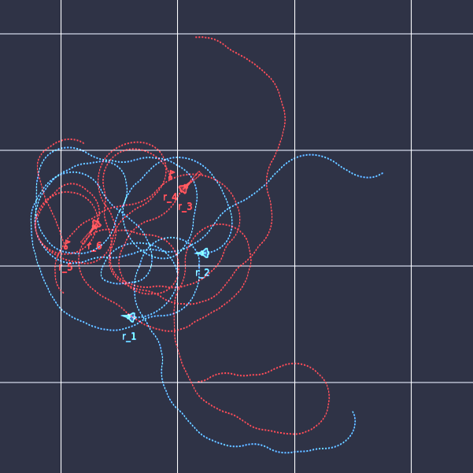
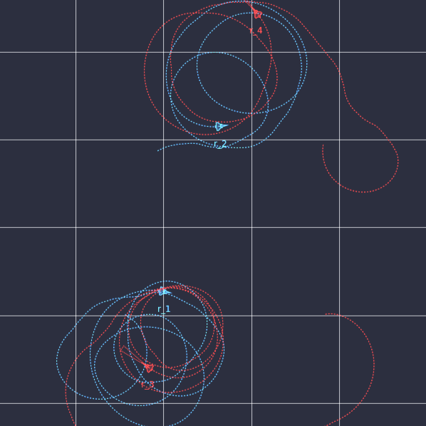
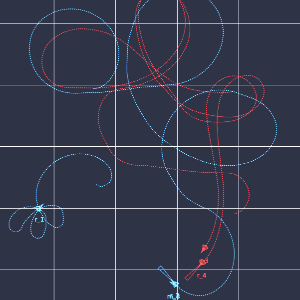

# HHMARL 2D

Heterogeneous Hierarchical Multi-Agent Reinforcement Learning for Air Combat Maneuvering, the implementation of the method proposed in this [paper](https://arxiv.org/abs/2309.11247).

  

## Overview

We use low-level policies for either fight or escape maneuvers. These will be first trained, then employed in the high-level hierarchy as part of environment.


## Requiered Packages 

- ray["rllib"] == 2.4.0
- torch >= 2.0.0
- numpy == 1.24.3
- gymnasium == 0.26.3
- tensorboard == 2.13.0
- pycairo == 1.23.0
- cartopy >= 0.21.0
- geographiclib == 2.0
- tqdm

## Training

Run `train_hetero.py` for heterogeneous agents training in low-level mode and `train_hier.py` to train the high-level policy (commander). The low-level policies must be pre-trained and stored in order to start training of the commander policy. At this stage, low-level policy training is configured for **2vs2** and high-level policy training for **3vs3**. The reason for this is the structure of Ray for setting up Centralized Critics. But evaluations can be done in any combat configuration.

### Procedure
For training the full model, proceed as follows:

***1) Run `train_hetero.py`***
- Start with `level=1` and `agent_mode="fight"`. When finished, continue training up to `level=4` with `agent_mode="fight"`. It is important to stop at level 4, for now.
- Run file with `level=3` and `agent_mode="escape"`.
- Run file with `level=5` and `agent_mode="fight"`.
- Finally, run file with `level=5` and `agent_mode="escape"`. This is not crucial, but recommended. 

***2) Run `train_hier.py`***
- Run file to train commander. No further steps needed.

***3) Run `evaluation.py`***
- Set `eval_hl=True` to evaluate model with commander.
- You can set any *n-vs-m* combat configuration now. For this, set the parameters `num_agents` and `num_opps`.
- You can also change the opponent behavior with `hier_opp_fight_ratio`. This specifies the probability for choosing fight policy, i.e., `hier_opp_fight_ratio=100` sets opponents purely in fight mode, and `hier_opp_fight_ratio=0` purely to escape mode. Default is `hier_opp_fight_ratio=75`.
- Set `eval_hl=False` to evaluate low-level policies without commander. Set also `hier_opp_fight_ratio=100`, otherwise you evaluate against fight and escape with the corresponding ratio. 
- With `eval_hl=False`, you can also specify which levels (3-5) you want to compare in any configuration. You can do this with `eval_level_ag` and `eval_level_opp` to set the levels together with `num_agents` and `num_opps` to specify the combat scenario.
- Inside the evaluation folder, you get a `.json` file with all metrics. 

### Curriculum Learning

- Training is done in levels (1-5) for fight policy. The opponent behaviour per level is as follows. L1: static, L2: random, L3: scripted, L4: uses L3 policy, L5: uses L3, L4 and escape policies.
- The relevant arguments will be set automatically when training with the above procedure. But you can also manually set `level`, `agent_mode` and `restore` before starting training. 
- The algorithm checkpoint and the rendering images will be stored in `results/L{X}_{mode}_2-vs-2`. 
- High-level policy is **not** trained in curriculum fashion.

### Configurations
Most important arguments to set are the following. All arguments can be found in `config.py`.

- `agent_mode` is either "fight" or "escape"
- `level` from 1 to 5 (only for low-level)
- `rew_scale` to scale rewards. Default 1.
- `glob_frac` is a float number for reward sharing between agents. Default 0.
- `restore` either True or False, to restore training. When training in the above procedure, it will be automatically set to True when `level>=2`.
- `gpu` either 0 or 1, to use gpu or not. Default 0.
- `num_workers` is number of parallel samplers (threads). Default 4.
- `epochs` number of training epochs. Default 10'000.
- `batch_size` to adjust PPO training batch size. Default 2000.
- `eval` either True or False, for having rendered images in log folder. Default True.
- `render` either True or False, to visualize the current combat scenario. It stores iteratively the current combat situation as `current.png` file in log folder. When the file is opened in VS Code while the evaluation process runs, you get a "video" of the combat scene.
- `map_size` is a float that will be mapped as -> x*100 = x[km], e.g. 0.3 -> 30 km per axis. 

### Inference

Levels 4 and 5 use the previously learned policies (fictitious self-play). Ray seems inconsistent when calling its method `Policy.compute_single_action()`. Therefore, the learned policies will be stored during training in folder `policies` from level 3 onwards. The actions will then be computed manually inside the method `_policy_actions()`. You can also manually export policies by running `policy_export.py` (have a look at it and make configurations as you want).

### Commander Sensing
Change `N_OPPS_HL` in `env_hier.py`, `train_hier.py` and `ac_models_hier.py` to change detected opponents (N2-vs-N3 in the paper). E.g. setting `N_OPPS_HL=3` allows the Commander to detect 3 opponents for an agent and can select one of these three to attack.

### GPU vs CPU
Ray allows training on GPU but during several experiments, the performance was worse compared to CPU. Reason still unknown. This might improve in future versions. In our case, GPU was an RTX 3080Ti and CPU i9-13900H.

## Note
HHMARL 3D is on its way with more advanced rendering ...

## Citation

```
@misc{hhmarl2d,
  author = {Ardian Selmonaj and Oleg Szehr and Giacomo Del Rio and Alessandro Antonucci and Adrian Schneider and Michael Rüegsegger},
  title = {Hierarchical Multi-Agent Reinforcement Learning for Air Combat Maneuvering},
  year = {2023},
  eprint = {arXiv:2309.11247},
}
```
