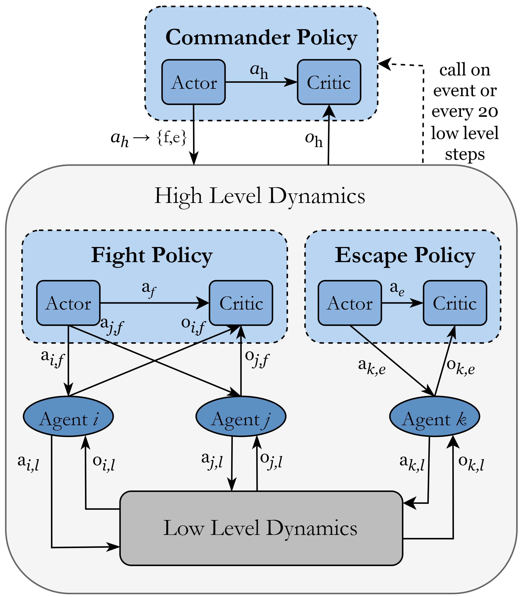

# HHMARL 2D

Heterogeneous Hierarchical Multi-Agent Reinforcement Learning for Air Combat Maneuvering, the implementation of the method proposed in this [paper](https://arxiv.org/abs/2309.11247).

  

## Overview

We use low-level policies for either fight or escape maneuvers. These will be first trained, then employed in the high-level hierarchy as part of environment.

## Requiered Packages 

- ray["rllib"] == 2.4.0
- torch >= 2.0.0
- numpy == 1.24.3
- gymnasium == 0.26.3
- tensorboard == 2.13.0
- pycairo == 1.23.0
- cartopy >= 0.21.0
- geographiclib == 2.0
- tqdm

## Training

Run `train_hetero.py` for heterogeneous agents training in low-level mode and `train_hier.py` to train the high-level policy (commander). The low-level policies must be pre-trained and stored in order to start training of the commander policy. At this stage, low-level policy training is configured for **2vs2** and high-level policy training for **3vs3**. The reason for this is the structure of Ray for setting up Centralized Critics.

### Configurations
Most important arguments to set are:

- `agent_mode` is either "fight" or "escape"
- `level` from 1 to 5 (only for low-level)
- `rew_scale` to scale rewards. Default 1.
- `glob_frac` is a float number for reward sharing between agents. Default 0.
- `restore` either True or False, to restore training
- `log_name` to define the experiment name
- `gpu` either 0 or 1, to use gpu or not. Default 0.
- `num_workers` is number of parallel samplers (threads). Default 4.
- `epochs` number of training epochs. Default 10'000.
- `batch_size` to adjust PPO training batch size. Default 2000.
- `eval` either True or False, for having evaluations stored as images. Default True.
- `render` either True or False, to visualize the current combat scenario. It stores iteratively the current combat situation as .png file
- `map_size` is a float that will be mapped as -> x*100 = x[km], e.g. 0.3 -> 30 km per axis. 
- `friendly_kill` to consider friendly kill or not. Default True.
- `friendly_punish` if both agents to punish if friendly kill occurred. Default True.

### Curriculum Learning

- Training is done in levels (1-5) for low-level policies. After completion of training in a level, you have to manually start the next level training and restore the algorithm by setting `restore=True`. 
- The algorithm and the evaluation/rendering images will be stored in `results/levelX_{fight/escape}`. 
- When `agent_mode` is set to "escape", `level=3` is set to train against scripted opponents directly.
- High-level policy is **not** trained in curriculum fashion.

### Inference

Levels 4 and 5 use the previously learned policies (fictitious self-play). Ray seems inconsistent when calling its method `Policy.compute_single_action()`. Therefore, the learned policies will be stored in folder `policies` from level 3 onwards. The actions will then be computed manually inside the method `_policy_actions()`.

### Commander Sensing
Change `N_OPPS_HL` in `env_hier.py`, `train_hier.py` and `ac_models_hier.py` to change detected opponents. E.g. setting `N_OPPS_HL=3` allows the Commander to detect 3 opponents for an agent and can select one of these three to attack.

### GPU vs CPU
Ray allows training on GPU but during several experiments, the performance was worse compared to CPU. Reason still unknown. This might improve in future versions. In our case, GPU was an RTX 3080Ti and CPU i9-13900H.

## Note
HHMARL 3D is on its way with more advanced rendering ...
